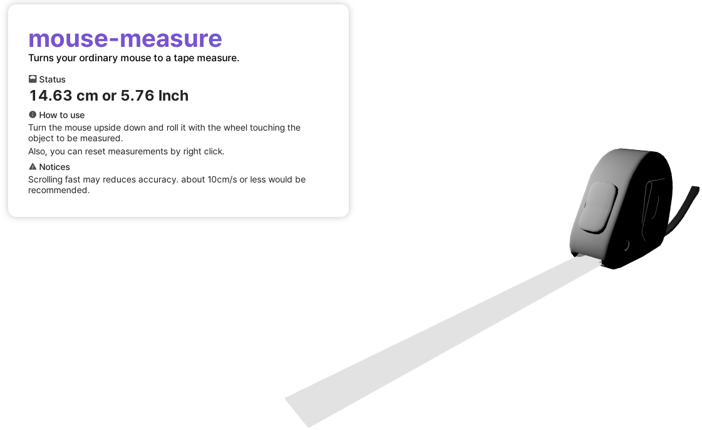

# mouse-measure
mouse-measure turns your ordinary mouse into a tape measure!

Just scroll your mouse wheel over objects you want to measure. 

[Demo page](https://2o4oo.github.io/tape-measure-demo/)

